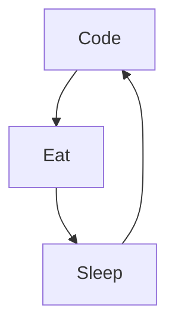

### ╰⊱⭐⊱╮꧁ Lucie Guinebert ꧂╭⊱⭐≺

Je suis Lucie, vivant en Seine et Marne, en reconvertion professionel en Développement Web et Web mobile ! 😁

Réellement :

- 🔭Je recherche un stage de 3 à 6 mois à partir de début avril 2023 ^^
- 🌱J'apprends des choses incroyables !
- ⚡Fun fact : Passionée de mangas, j'adore les chats ₍^ >ヮ<^₎
- 📫Comment me joindre : Linkedin, Facebook

➳༻❀ ☕ ❀༺➳

### Contactez-moi :

;

### Languages et outils : 

 

;

### Ma routine quotidienne :

### ⭐Statistiques GitHub

          
          
          
          
          

